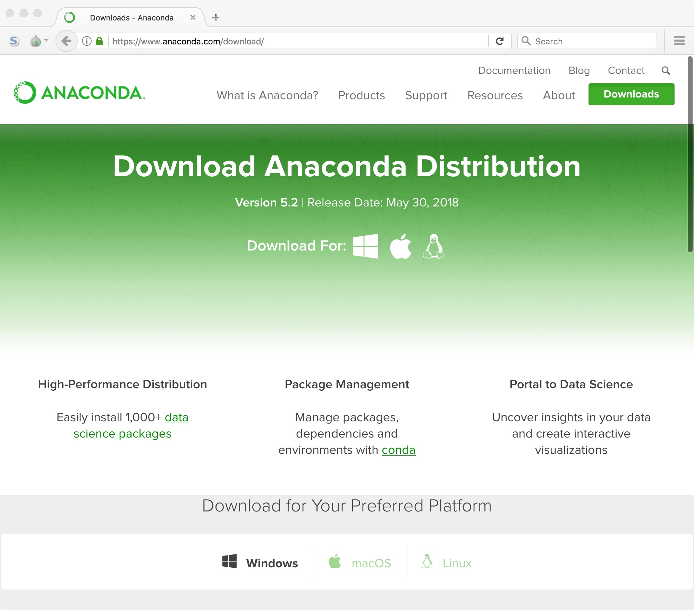
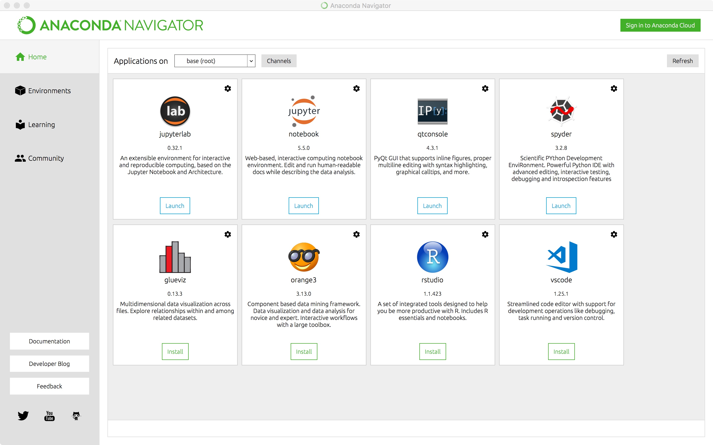
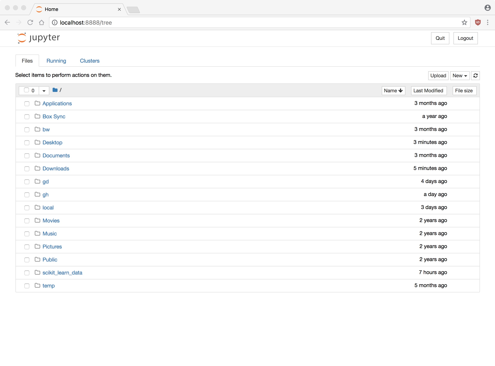

```{r setup, include=FALSE}
knitr::opts_chunk$set(eval = TRUE)
knitr::opts_chunk$set(fig.path = "../assets/class02-introduction-to-r/")
knitr::opts_chunk$set(fig.height = 5)
knitr::opts_chunk$set(fig.width = 8.5)
knitr::opts_chunk$set(out.width = "100%")
knitr::opts_chunk$set(dpi = 300)
```

## GitHub

If you do not already have an account, go to the main webpage and create a
free account. Try to pick a professional name as you may find that you want
to make this public at some point:

- [https://github.com/](https://github.com/)

Next, follow this link and accept the invitation:

- [https://classroom.github.com/a/](https://classroom.github.com/a/)

Assuming you have a valid GitHub account, this will set up a repository where
all of your projects for this semester should be posted.

## First Notebook

Now, download the first lab assignment here:

- [Lab 02: Introduction]()

Then, navigate to wherever you saved the file and open it in the Jupyter 

# Setting up Python

## Download software

We are going to use a version of Python distributed by Anaconda. This should
simplify our installation and streamline our work for the semester. Note that
we will be using Python 3.

To start, navigate to the Anaconda website:

> [https://www.anaconda.com/download/](https://www.anaconda.com/download/)

You should see a page like this:



Click on the correct platform and download Python 3.6. This is a large file
so it may take a few minutes. Note that there will be a pop-up to be on their
mailing list. Just ignore this; the download will start automatically.

Once the download is complete install the software on your computer. Note that
on macOS you need to drag 

## Start Anaconda Navigator

Once installed, run the Anaconda Navigator from your applications directory.
You should see a screen that looks like this:



If you have this screen, you should see a tile called "jupyter". Click the 
launch button below the logo. This runs the Python engine and opens a notebook
in your web browser. This is what we will be using this semester to run 
Python code.



Now, navigate to where you saved the first IPython notebook and open it.


Start working through the first set of instructions.

## Install Modules

Anaconda Python comes with many of the modules needed for general purpose 
data science work. We need to install several others to help us work with 
text and image data. Some of these can be a pain, so that is why I have
dedicated today to getting these issues sorted out.

Return to the Anaconda Navigator application and click on Environments on the
left-hand side. Now, on the right, click on the pull-down menu that says 
"Installed" to select "All" and search for the package "keras". You should
see one search result pop up. Select this and then click Apply at the bottom.
This will install several packages and may take a bit of time.

Once the installation is complete return to your IPython notebook and make 
sure that you can load keras. Note that it may give a warning; this is okay.

Next, repeat for the following libraries:

- spacy
- gensim
- opencv (make sure you select the package just called "opencv")

I just tested all of these on my computer and they worked fine. If you run into
an issues please let me and everyone else know today.


