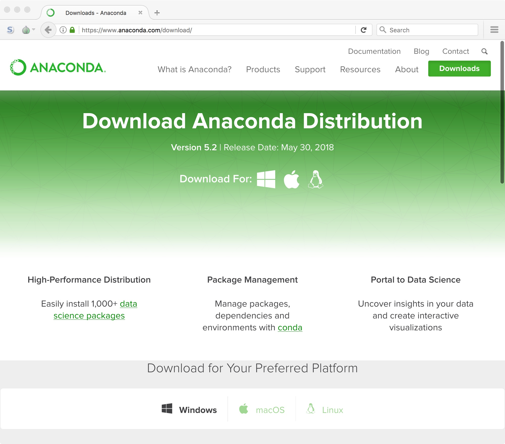
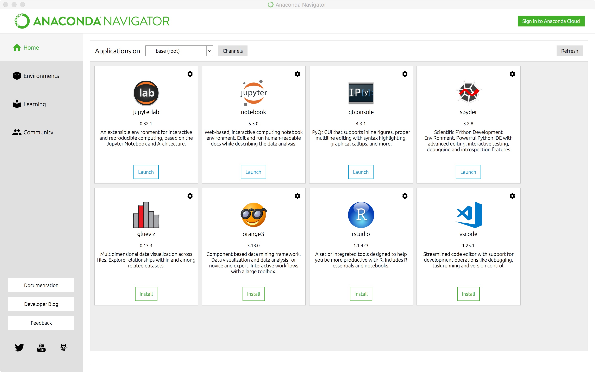
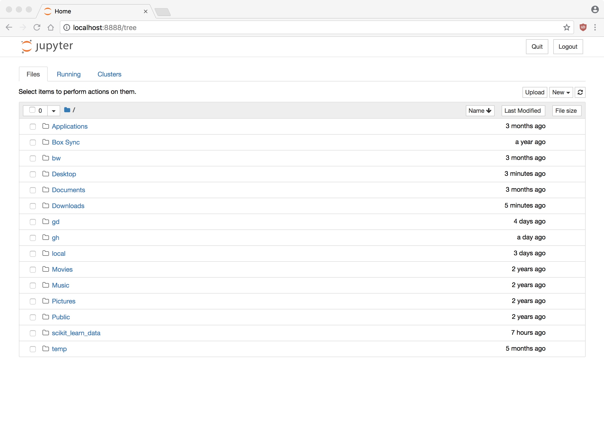

## GitHub

If you do not already have an account, go to the main webpage and create a
free account. Try to pick a professional name as you may find that you want
to make this public at some point:

- [https://github.com/](https://github.com/)

Next, follow this link and accept the invitation:

- [https://classroom.github.com/a/](https://classroom.github.com/a/wPpmwCzM)

Assuming you have a valid GitHub account, this will set up a repository where
all of your projects for this semester should be posted.

## First Notebook

Now, download the first lab assignment here:

- [Lab 02: Introduction]()

Then, navigate to wherever you saved the file and open it in the Jupyter 

# Setting up Python

## Download software

We are going to use a version of Python distributed by Anaconda. This should
simplify our installation and streamline our work for the semester. Note that
we will be using Python 3.

To start, navigate to the Anaconda website:

> [https://www.anaconda.com/download/](https://www.anaconda.com/download/)

You should see a page like this:

Click on the correct platform and download Python 3.6. This is a large file
so it may take a few minutes. Note that there will be a pop-up to be on their
mailing list. Just ignore this; the download will start automatically.

Once the download is complete install the software on your computer. Note that
on macOS you need to drag 

## Start Anaconda Navigator

Once installed, run the Anaconda Navigator from your applications directory.
You should see a screen that looks like this:

If you have this screen, you should see a tile called "jupyter". Click the 
launch button below the logo. This runs the Python engine and opens a notebook
in your web browser. This is what we will be using this semester to run 
Python code.

Now, once you save a Jupyter Notebook, navigate to where you saved the file and
open it:

