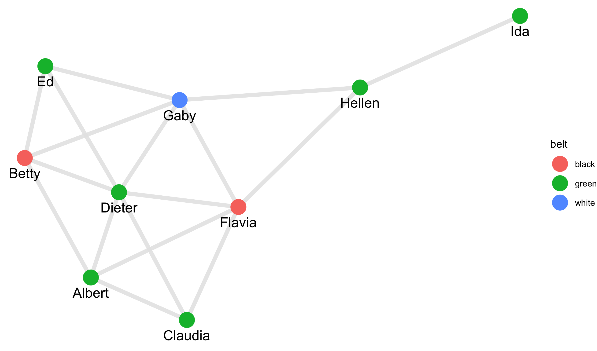
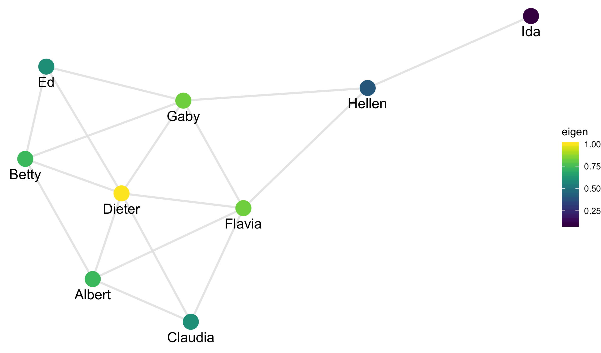
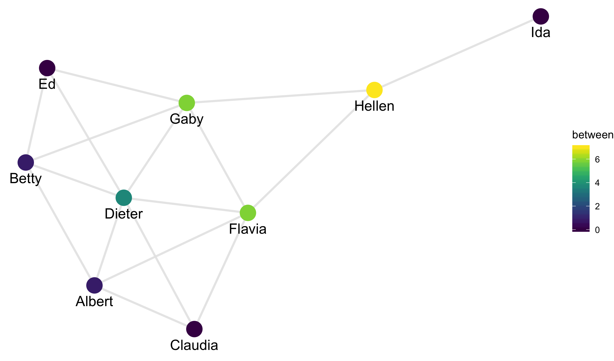
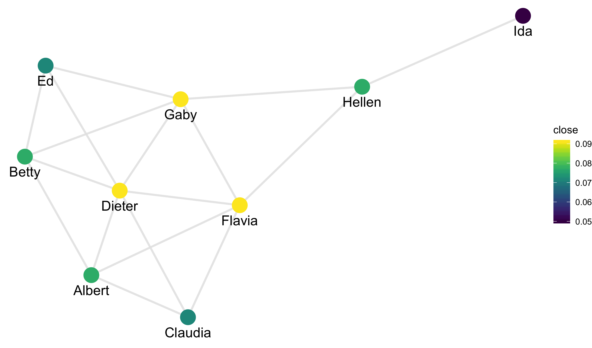
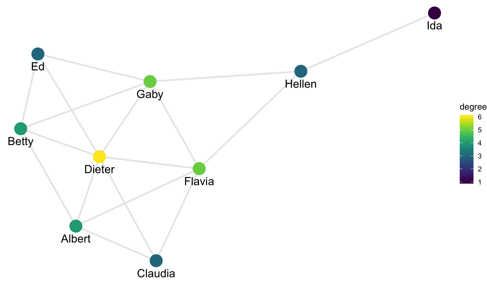
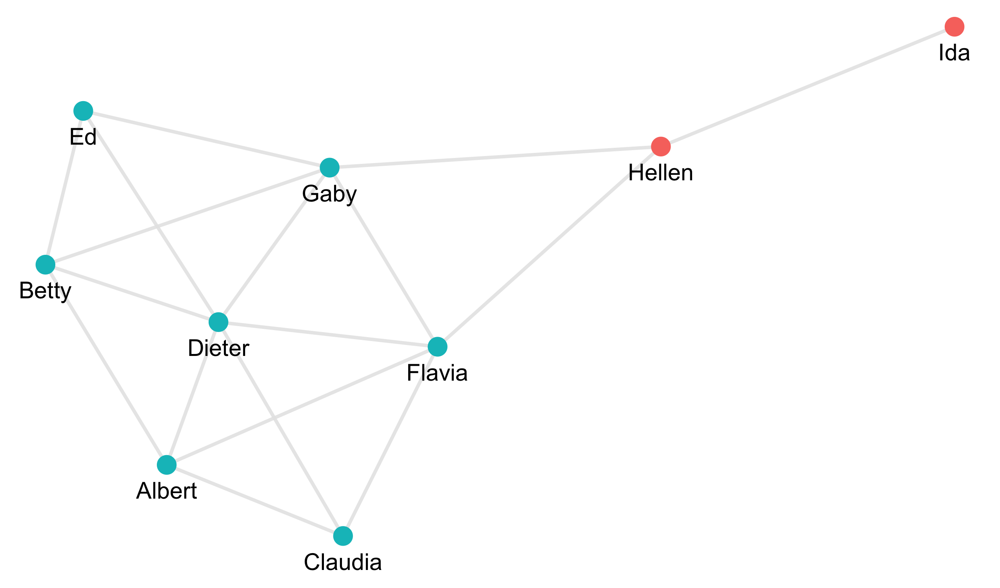

## Networks

Network data consists of two types of objects:

- nodes, the primary object of study
- edges, connections between nodes

These two things can in theory be any set of objects with links between them.
Some common examples include:

- social networks: nodes are people and edges describe relationships
- family trees: nodes are people and edges describe marriage or child-parent relationships
- citation networks: nodes are papers/articles/books and edges are citations from one work to another
- similarity network: nodes are almost any entity and edges describe objects that are particularly
similar

Today we will see ways of working with network data. I'll start here with the general
concepts; you'll see in the tutorials how to work with networks in Python.

Note that you may have heard of what I call networks under the term of a *graph*. This
is the common name in the mathematical study. In math nodes are often called verticies.
You'll also hear edges called both links and connections. These all represent the same
structures, though the kinds of questions mathematicians are concerned with are generally
distinct from those of interest in statistics.

## Kite example

Our first network dataset is an artificial network created to illustrate some of the
primary properties. The graph is called a "kite" because of its shape.
We will move to more interesting data soon.

Once installed, load the smodels package and pass the edges and nodes to the
function `graph_data`:

We can see the graph below.
Notice that the nodes are spread out over the space in a reasonably nice pattern.

Notice that the layout made linked nodes close together and minimizes crossing of edges. The
algorithm actually uses a physics simulation where edges are treated as springs and nodes as
positively charged particles. Hence, the nodes want to spread out but the edge push together
neighboring nodes.

## Centrality

There are a few different ways of measuring how central or important a node appears
within a network. Eigenvalue centrality constructs a score for each node such that
each nodes centrality score is proportional to the sum of its neighbors scores.
In math:

$$ s_{i} = \lambda \cdot \sum_{j \in \text{neighbors of node i}} s_j $$

So the more neighbors a node has the higher it's centrality, though neighbors that are central
themselves contribute more than nodes that are not otherwise very central. We won't go into the
math today, but this can be solved by computing the eigenvalue problem for the adjacency matrix
of the graph.

In this measurement, we see that Dieter is the most central node. He is right in the middle of the
cluster of most densely connection points.

Another centrality measurement is called *betweenness*. Consider all shortest paths between all pairs
of nodes in the network. Betweenness measures, for each node, the proportion of these paths that run
through a given node. We can plot this as well:

Notice now that Hellen is much more central because
she connects everyone in the graph to Ida.

Another measurement of centrality is called *closeness*. It is defined as the
average distance (number of hops) from each node to a given node of interest.

Here Gaby, Flavia, and Dieter are equally central. Flavia and Gaby have fewer direct links,
but are closer to Ida than Dieter.

Finally, we can also use degree centrality. This simply measures how many neighbors a graph
has.

Notice that these measures agree to some extent but do measure slightly different aspects
of centrality. Nodes that have a high betweenness but relatively low eigen centrality are
known as *gatekeepers* (such as Hellen above). These are the influencial people who link
clusters within a graph.

## Clusters

Speaking of clusters, we can also define clustering algorithms over a network. Here
is an algorithm applied to our network:

There is a large primary group (the blue one) and the small subgroup of Hellen and
Ida (the red one).
